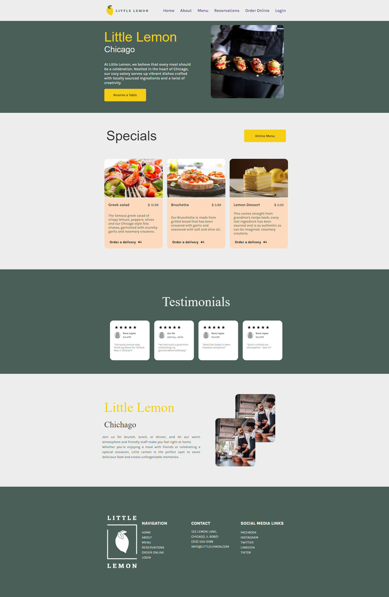
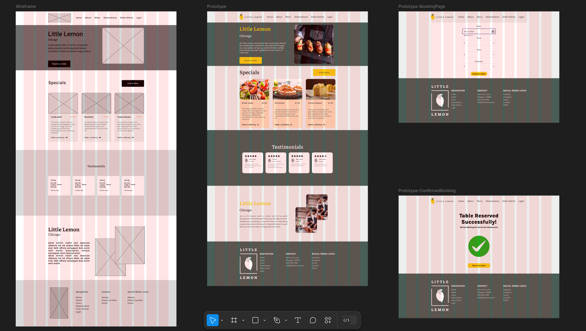

# Meta Front-End Developer Professional Certificate - Front-End Developer Capstone | Portfolio-Project

## Description

For the Meta Front-End Developer Professional Certificate - Front-End Developer Capstone | Portfolio-Project, I created a complete, responsive website from scratch, focusing on both the design and technical functionality. Starting with Figma, I designed a visually appealing, easy-to-navigate layout that captures the brand’s personality and invites users to explore.

Once the design was set, I built the structure using HTML and styled it with CSS to bring the layout to life. I used React to make the site responsive and interactive. I connected an API for table reservation.
 
## Screenshot(s)

### Homepage:



### Figma Design:



## Used Software(s)
- Visual Studio Code
- Figma

## Run Locally

Note: Please ensure you have installed <code><a href="https://nodejs.org/en/download/">nodejs</a></code>

Clone my repository
```bash
  git clone https://github.com/istvanszasz99/Meta_Front-End_Developer_Professional_Certificate_Front-End_Developer_Capstone_Portfolio_Project.git
```

Go to the project directory & install dependencies
```bash
  npm install
```

View project in browser
```bash
  npm start
```

## Preview
coming soon...

## Author
- [@istvanszasz99](https://www.github.com/istvanszasz99)
